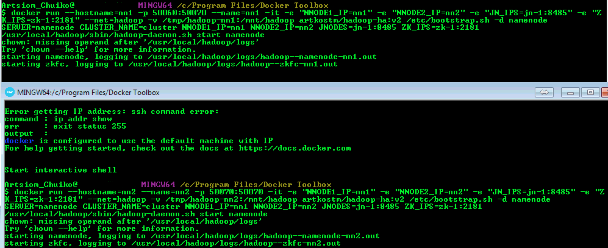

### Task 1 Hadoop HA

For the sake of simplicity we will use 1 Zookeeper, 1 JournalNode, 2 NameNodes and 1 DataNode to be able to run on a single Docker host. It goes without saying that you should adjust these numbers in production.

- Create a common docker network

```docker network create hadoop```

- Start Zookeeper

```docker run --net=hadoop --name zk-1 --restart always -d zookeeper```

- Start JournalNode

```docker run -d --name=jn-1 -e "NNODE1_IP=nn1" -e "NNODE2_IP=nn2" -e "JN_IPS=jn-1:8485" -e "ZK_IPS=zk-1:2181" --net=hadoop -v /tmp/hadoop-jn:/mnt/hadoop artkostm/hadoop-ha:v2 /etc/bootstrap.sh -d journalnode```

- Format the active NameNode

```docker run --hostname=nn1 --name=nn1 -it -e "NNODE1_IP=nn1" -e "NNODE2_IP=nn2" -e "JN_IPS=jn-1:8485" -e "ZK_IPS=zk-1:2181" --net=hadoop -v /tmp/hadoop-nn1:/mnt/hadoop artkostm/hadoop-ha:v2 /etc/bootstrap.sh -d format```

- Sync the initial state to the standby NameNode

```docker run --hostname=nn2 --name=nn2 -it -e "NNODE1_IP=nn1" -e "NNODE2_IP=nn2" -e "JN_IPS=jn-1:8485" -e "ZK_IPS=zk-1:2181" --net=hadoop -v /tmp/hadoop-nn2:/mnt/hadoop -v /tmp/hadoop-nn1:/mnt/shared/nn1 artkostm/hadoop-ha:v2 /etc/bootstrap.sh -d standby```
<br>Notice that the volume from nn1 - which now holds the initial cluster state - is just mounted to a certain directory where all data will be copied to nn2's volume.
At this point both volumes hold the initial cluster state and can be used as a mountpoint in actual NameNode images.

- Start both NameNodes (separate terminals)

```docker run --hostname=nn1 -p 50060:50070 --name=nn1 -it -e "NNODE1_IP=nn1" -e "NNODE2_IP=nn2" -e "JN_IPS=jn-1:8485" -e "ZK_IPS=zk-1:2181" --net=hadoop -v /tmp/hadoop-nn1:/mnt/hadoop artkostm/hadoop-ha:v2 /etc/bootstrap.sh -d namenode```

```docker run --hostname=nn2 --name=nn2 -p 50070:50070 -it -e "NNODE1_IP=nn1" -e "NNODE2_IP=nn2" -e "JN_IPS=jn-1:8485" -e "ZK_IPS=zk-1:2181" --net=hadoop -v /tmp/hadoop-nn2:/mnt/hadoop artkostm/hadoop-ha:v2 /etc/bootstrap.sh -d namenode```
<br>Now both NameNodes should be running, check it by visiting the WebUI on Port 50060 (nn1) and 50070 (nn2). nn2 should be standby while nn1 is active.



- Start DataNodes

```docker run -d -e "NNODE1_IP=nn1" -e "NNODE2_IP=nn2" -e "JN_IPS=jn-1:8485" -e "ZK_IPS=zk-1:2181" --net=hadoop -v /tmp/hadoop-dn-1:/mnt/hadoop artkostm/hadoop-ha:v2 /etc/bootstrap.sh -d datanode```

- Copy all.zip from the host machine to a datanode: ```docker cp mycontainer:/all.zip all.zip```

- Then put the file to hdfs: ```hdfs dfs -put /all.zip hdfs://nn1:8020/tmp```

Now you can see active namenode address on web ui. For that go to the web ui on [localhost or DOCKER_HOST]:50060 for the active namenode (nn1) and [localhost or DOCKER_HOST]:50070 for the standby namenode (nn2, it must have standby state)


Check files on HDFS:


- Kill the active NameNode to trigger failover.

In the Active namenode, kill the namenode daemon or whole container nn1 to change the Standby namenode to active namenode. Just press CTRL-C on the terminal which is attached to the active NameNode. Now watch on the WebUI how the standby NameNode gets active.
DataNodes are still connected. Wait a bit and restart the formerly active NameNode. Now it will be the standby Node.


All files are still accessible on HDFS:


### Task 2 Yarn App

Download akkeeper jar and bin for here https://bintray.com/izeigerman/akkeeper/download_file?file_path=akkeeper_2.12-0.3.3.tgz

Build a jar file with actors to deploy: ```sbt assembly```

To run integration and multi-jvm tests use ```sbt it:test``` and ```sbt mutlti-jvm:test```.

Our application works as follows:
- We create 2 containers and 2 actors, one for the master instance (eg `tmaster`) and one for the worker instances (eg `tworker`)
- We launch 1 instance of the tmaster container at the beginning.
- The tmaster instance communicates to Akkeeper Master via Akka to launch tworker instances.
- All instances (1 Akkeeper AM, 1 tmaster and N tworker) are part of the same Akka Cluster so the communication between them is super straightforward.

Run yarn app: ```./bin/akkeeper --config src/main/resources/config.conf```


To run our app we have to deploy the master actor by using either curl command or specifying tnstance configuration in config.conf file

```
curl -X POST -H "Contetn-Type: application/json" -d "@body.json" http://host:5052/api/v1/deploy

cat body.json
{
    "name": "tmaster",
    "quantity": 1
}
```
This setting allows us to automatically deploy the master actor:
```
...
akkeeper.instances = [
  {
     name = tmaster
     quantity = 1
     }
]
```

Here are some logs:

```log
2018-12-16 14:36:27 INFO  RMProxy:125 - Connecting to ResourceManager at /0.0.0.0:8032
2018-12-16 14:36:35 INFO  ClientRMService:297 - Allocated new applicationId: 1
2018-12-16 14:36:35 INFO  ClientRMService:615 - Application with id 1 submitted by user arttsiom.chuiko
2018-12-16 14:36:35 INFO  RMAppImpl:1105 - Storing application with id application_1544960128505_0001
2018-12-16 14:36:35 INFO  RMAuditLogger:170 - USER=arttsiom.chuiko	IP=192.168.100.73	OPERATION=Submit Application Request	TARGET=ClientRMService	RESULT=SUCCESS	APPID=application_1544960128505_0001
2018-12-16 14:36:35 INFO  RMAppImpl:779 - application_1544960128505_0001 State change from NEW to NEW_SAVING
2018-12-16 14:36:35 INFO  RMStateStore:199 - Storing info for app: application_1544960128505_0001
2018-12-16 14:36:35 INFO  RMAppImpl:779 - application_1544960128505_0001 State change from NEW_SAVING to SUBMITTED
2018-12-16 14:36:35 INFO  ParentQueue:360 - Application added - appId: application_1544960128505_0001 user: arttsiom.chuiko leaf-queue of parent: root #applications: 1
2018-12-16 14:36:35 INFO  CapacityScheduler:744 - Accepted application application_1544960128505_0001 from user: arttsiom.chuiko, in queue: default
2018-12-16 14:36:55 INFO  RMAppImpl:779 - application_1544960128505_0001 State change from SUBMITTED to ACCEPTED
2018-12-16 14:36:55 INFO  ApplicationMasterService:679 - Registering app attempt : appattempt_1544960128505_0001_000001
2018-12-16 14:36:55 INFO  RMAppAttemptImpl:809 - appattempt_1544960128505_0001_000001 State change from NEW to SUBMITTED
2018-12-16 14:36:55 WARN  LeafQueue:656 - maximum-am-resource-percent is insufficient to start a single application in queue, it is likely set too low. skipping enforcement to allow at least one application to start
2018-12-16 14:36:55 WARN  LeafQueue:691 - maximum-am-resource-percent is insufficient to start a single application in queue for user, it is likely set too low. skipping enforcement to allow at least one application to start
2018-12-16 14:36:55 INFO  LeafQueue:720 - Application application_1544960128505_0001 from user: arttsiom.chuiko activated in queue: default
2018-12-16 14:36:55 INFO  LeafQueue:744 - Application added - appId: application_1544960128505_0001 user: arttsiom.chuiko, leaf-queue: default #user-pending-applications: 0 #user-active-applications: 1 #queue-pending-applications: 0 #queue-active-applications: 1
2018-12-16 14:36:55 INFO  CapacityScheduler:773 - Added Application Attempt appattempt_1544960128505_0001_000001 to scheduler from user arttsiom.chuiko in queue default
2018-12-16 14:36:55 INFO  RMAppAttemptImpl:809 - appattempt_1544960128505_0001_000001 State change from SUBMITTED to SCHEDULED
2018-12-16 14:36:56 INFO  RMContainerImpl:422 - container_1544960128505_0001_01_000001 Container Transitioned from NEW to ALLOCATED
2018-12-16 14:36:56 INFO  RMAuditLogger:141 - USER=arttsiom.chuiko	OPERATION=AM Allocated Container	TARGET=SchedulerApp	RESULT=SUCCESS	APPID=application_1544960128505_0001	CONTAINERID=container_1544960128505_0001_01_000001
2018-12-16 14:36:56 INFO  SchedulerNode:152 - Assigned container container_1544960128505_0001_01_000001 of capacity <memory:2048, vCores:1> on host 192.168.100.73:55741, which has 1 containers, <memory:2048, vCores:1> used and <memory:2048, vCores:7> available after allocation
2018-12-16 14:36:56 INFO  AbstractContainerAllocator:89 - assignedContainer application attempt=appattempt_1544960128505_0001_000001 container=container_1544960128505_0001_01_000001 queue=org.apache.hadoop.yarn.server.resourcemanager.scheduler.capacity.allocator.RegularContainerAllocator@5d7e66a2 clusterResource=<memory:4096, vCores:8> type=OFF_SWITCH
2018-12-16 14:36:56 INFO  NMTokenSecretManagerInRM:200 - Sending NMToken for nodeId : 192.168.100.73:55741 for container : container_1544960128505_0001_01_000001
2018-12-16 14:36:56 INFO  RMContainerImpl:422 - container_1544960128505_0001_01_000001 Container Transitioned from ALLOCATED to ACQUIRED
2018-12-16 14:36:56 INFO  NMTokenSecretManagerInRM:146 - Clear node set for appattempt_1544960128505_0001_000001
2018-12-16 14:36:56 INFO  RMAppAttemptImpl:1955 - Storing attempt: AppId: application_1544960128505_0001 AttemptId: appattempt_1544960128505_0001_000001 MasterContainer: Container: [ContainerId: container_1544960128505_0001_01_000001, NodeId: 192.168.100.73:55741, NodeHttpAddress: 192.168.100.73:55752, Resource: <memory:2048, vCores:1>, Priority: 0, Token: Token { kind: ContainerToken, service: 192.168.100.73:55741 }, ]
2018-12-16 14:36:56 INFO  ParentQueue:475 - assignedContainer queue=root usedCapacity=0.5 absoluteUsedCapacity=0.5 used=<memory:2048, vCores:1> cluster=<memory:4096, vCores:8>
2018-12-16 14:36:56 INFO  RMAppAttemptImpl:809 - appattempt_1544960128505_0001_000001 State change from SCHEDULED to ALLOCATED_SAVING
2018-12-16 14:37:00 INFO  YarnClientImpl:274 - Submitted application application_1544960128505_0001
2018-12-16 14:37:00 INFO  YarnLauncher:193 - Launched Akkeeper Cluster application_1544960128505_0001
2018-12-16 14:37:00 INFO  RMAppAttemptImpl:809 - appattempt_1544960128505_0001_000001 State change from ALLOCATED_SAVING to ALLOCATED
2018-12-16 14:37:00 INFO  AMLauncher:266 - Launching masterappattempt_1544960128505_0001_000001
2018-12-16 14:37:00 INFO  AMLauncher:111 - Setting up container Container: [ContainerId: container_1544960128505_0001_01_000001, NodeId: 192.168.100.73:55741, NodeHttpAddress: 192.168.100.73:55752, Resource: <memory:2048, vCores:1>, Priority: 0, Token: Token { kind: ContainerToken, service: 192.168.100.73:55741 }, ] for AM appattempt_1544960128505_0001_000001
2018-12-16 14:37:00 INFO  AMRMTokenSecretManager:195 - Create AMRMToken for ApplicationAttempt: appattempt_1544960128505_0001_000001
2018-12-16 14:37:00 INFO  AMRMTokenSecretManager:307 - Creating password for appattempt_1544960128505_0001_000001
2018-12-16 14:37:00 INFO  Server:1573 - Auth successful for appattempt_1544960128505_0001_000001 (auth:SIMPLE)
2018-12-16 14:37:00 INFO  ContainerManagerImpl:810 - Start request for container_1544960128505_0001_01_000001 by user arttsiom.chuiko
2018-12-16 14:37:00 INFO  ContainerManagerImpl:850 - Creating a new application reference for app application_1544960128505_0001
2018-12-16 14:37:00 INFO  ApplicationImpl:464 - Application application_1544960128505_0001 transitioned from NEW to INITING
2018-12-16 14:37:00 INFO  NMAuditLogger:89 - USER=arttsiom.chuiko	IP=192.168.100.73	OPERATION=Start Container Request	TARGET=ContainerManageImpl	RESULT=SUCCESS	APPID=application_1544960128505_0001	CONTAINERID=container_1544960128505_0001_01_000001
2018-12-16 14:37:00 INFO  ApplicationImpl:304 - Adding container_1544960128505_0001_01_000001 to application application_1544960128505_0001
2018-12-16 14:37:00 INFO  ApplicationImpl:464 - Application application_1544960128505_0001 transitioned from INITING to RUNNING
2018-12-16 14:37:00 INFO  ContainerImpl:1163 - Container container_1544960128505_0001_01_000001 transitioned from NEW to LOCALIZING
2018-12-16 14:37:00 INFO  AuxServices:215 - Got event CONTAINER_INIT for appId application_1544960128505_0001
2018-12-16 14:37:00 INFO  AMLauncher:132 - Done launching container Container: [ContainerId: container_1544960128505_0001_01_000001, NodeId: 192.168.100.73:55741, NodeHttpAddress: 192.168.100.73:55752, Resource: <memory:2048, vCores:1>, Priority: 0, Token: Token { kind: ContainerToken, service: 192.168.100.73:55741 }, ] for AM appattempt_1544960128505_0001_000001
2018-12-16 14:37:00 INFO  RMAppAttemptImpl:809 - appattempt_1544960128505_0001_000001 State change from ALLOCATED to LAUNCHED
2018-12-16 14:37:00 INFO  LocalizedResource:203 - Resource file:/Users/arttsiom.chuiko/.akkeeper/application_1544960128505_0001/akkeeper.jar transitioned from INIT to DOWNLOADING
2018-12-16 14:37:00 INFO  LocalizedResource:203 - Resource file:/Users/arttsiom.chuiko/.akkeeper/application_1544960128505_0001/user_config.conf transitioned from INIT to DOWNLOADING
2018-12-16 14:37:00 INFO  ResourceLocalizationService:712 - Created localizer for container_1544960128505_0001_01_000001
2018-12-16 14:37:00 INFO  ResourceLocalizationService:1194 - Writing credentials to the nmPrivate file /Users/arttsiom.chuiko/git/akka-yarn-app/target/com.github.sakserv.minicluster.impl.YarnLocalCluster/com.github.sakserv.minicluster.impl.YarnLocalCluster-localDir-nm-0_0/nmPrivate/container_1544960128505_0001_01_000001.tokens. Credentials list:
2018-12-16 14:37:00 INFO  DefaultContainerExecutor:644 - Initializing user arttsiom.chuiko
2018-12-16 14:37:00 INFO  DefaultContainerExecutor:126 - Copying from /Users/arttsiom.chuiko/git/akka-yarn-app/target/com.github.sakserv.minicluster.impl.YarnLocalCluster/com.github.sakserv.minicluster.impl.YarnLocalCluster-localDir-nm-0_0/nmPrivate/container_1544960128505_0001_01_000001.tokens to /Users/arttsiom.chuiko/git/akka-yarn-app/target/com.github.sakserv.minicluster.impl.YarnLocalCluster/com.github.sakserv.minicluster.impl.YarnLocalCluster-localDir-nm-0_0/usercache/arttsiom.chuiko/appcache/application_1544960128505_0001/container_1544960128505_0001_01_000001.tokens
2018-12-16 14:37:00 INFO  DefaultContainerExecutor:133 - Localizer CWD set to /Users/arttsiom.chuiko/git/akka-yarn-app/target/com.github.sakserv.minicluster.impl.YarnLocalCluster/com.github.sakserv.minicluster.impl.YarnLocalCluster-localDir-nm-0_0/usercache/arttsiom.chuiko/appcache/application_1544960128505_0001 = file:/Users/arttsiom.chuiko/git/akka-yarn-app/target/com.github.sakserv.minicluster.impl.YarnLocalCluster/com.github.sakserv.minicluster.impl.YarnLocalCluster-localDir-nm-0_0/usercache/arttsiom.chuiko/appcache/application_1544960128505_0001
2018-12-16 14:37:01 INFO  LocalizedResource:203 - Resource file:/Users/arttsiom.chuiko/.akkeeper/application_1544960128505_0001/akkeeper.jar(->/Users/arttsiom.chuiko/git/akka-yarn-app/target/com.github.sakserv.minicluster.impl.YarnLocalCluster/com.github.sakserv.minicluster.impl.YarnLocalCluster-localDir-nm-0_0/usercache/arttsiom.chuiko/appcache/application_1544960128505_0001/filecache/10/akkeeper.jar) transitioned from DOWNLOADING to LOCALIZED
2018-12-16 14:37:01 INFO  LocalizedResource:203 - Resource file:/Users/arttsiom.chuiko/.akkeeper/application_1544960128505_0001/user_config.conf(->/Users/arttsiom.chuiko/git/akka-yarn-app/target/com.github.sakserv.minicluster.impl.YarnLocalCluster/com.github.sakserv.minicluster.impl.YarnLocalCluster-localDir-nm-0_0/usercache/arttsiom.chuiko/appcache/application_1544960128505_0001/filecache/11/user_config.conf) transitioned from DOWNLOADING to LOCALIZED
2018-12-16 14:37:01 INFO  ContainerImpl:1163 - Container container_1544960128505_0001_01_000001 transitioned from LOCALIZING to LOCALIZED
2018-12-16 14:37:01 INFO  ContainerImpl:1163 - Container container_1544960128505_0001_01_000001 transitioned from LOCALIZED to RUNNING
2018-12-16 14:37:01 INFO  ContainersMonitorImpl:212 - ResourceCalculatorPlugin is unavailable on this system. org.apache.hadoop.yarn.server.nodemanager.containermanager.monitor.ContainersMonitorImpl is disabled.
2018-12-16 14:37:01 INFO  DefaultContainerExecutor:291 - launchContainer: [bash, /Users/arttsiom.chuiko/git/akka-yarn-app/target/com.github.sakserv.minicluster.impl.YarnLocalCluster/com.github.sakserv.minicluster.impl.YarnLocalCluster-localDir-nm-0_0/usercache/arttsiom.chuiko/appcache/application_1544960128505_0001/container_1544960128505_0001_01_000001/default_container_executor.sh]
2018-12-16 14:37:01 INFO  RMContainerImpl:422 - container_1544960128505_0001_01_000001 Container Transitioned from ACQUIRED to RUNNING
2018-12-16 14:37:24 INFO  NIOServerCnxnFactory:192 - Accepted socket connection from /0:0:0:0:0:0:0:1:55789
2018-12-16 14:37:24 INFO  ZooKeeperServer:900 - Client attempting to establish new session at /0:0:0:0:0:0:0:1:55789
2018-12-16 14:37:24 INFO  ZooKeeperServer:645 - Established session 0x167b6cd94650001 with negotiated timeout 60000 for client /0:0:0:0:0:0:0:1:55789
18/12/18 11:25:58 INFO event.slf4j.Slf4jLogger [AkkeeperSystem-akka.actor.default-dispatcher-3] []: Slf4jLogger started
18/12/18 11:25:58 DEBUG akka.event.EventStream [AkkeeperSystem-akka.actor.default-dispatcher-3] [EventStream(akka://AkkeeperSystem)]: logger log1-Slf4jLogger started
18/12/18 11:25:58 DEBUG akka.event.EventStream [AkkeeperSystem-akka.actor.default-dispatcher-3] [EventStream(akka://AkkeeperSystem)]: Default Loggers started
18/12/18 11:25:59 INFO akka.cluster.Cluster(akka://AkkeeperSystem) [AkkeeperSystem-akka.actor.default-dispatcher-3] [akka.cluster.Cluster(akka://AkkeeperSystem)]: Cluster Node [akka.tcp://AkkeeperSystem@10.6.165.60:60750] - Starting up...
18/12/18 11:25:59 INFO akka.cluster.Cluster(akka://AkkeeperSystem) [AkkeeperSystem-akka.actor.default-dispatcher-3] [akka.cluster.Cluster(akka://AkkeeperSystem)]: Cluster Node [akka.tcp://AkkeeperSystem@10.6.165.60:60750] - Registered cluster JMX MBean [akka:type=Cluster]
18/12/18 11:25:59 INFO akka.cluster.Cluster(akka://AkkeeperSystem) [AkkeeperSystem-akka.actor.default-dispatcher-3] [akka.cluster.Cluster(akka://AkkeeperSystem)]: Cluster Node [akka.tcp://AkkeeperSystem@10.6.165.60:60750] - Started up successfully
18/12/18 11:25:59 INFO akka.cluster.Cluster(akka://AkkeeperSystem) [AkkeeperSystem-akka.actor.default-dispatcher-2] [akka.cluster.Cluster(akka://AkkeeperSystem)]: Cluster Node [akka.tcp://AkkeeperSystem@10.6.165.60:60750] - No seed-nodes configured, manual cluster join required
18/12/18 11:25:59 DEBUG sslconfig.akka.AkkaSSLConfig [AkkeeperSystem-akka.actor.default-dispatcher-15] [AkkaSSLConfig(akka://AkkeeperSystem)]: Initializing AkkaSSLConfig extension...
18/12/18 11:25:59 DEBUG sslconfig.akka.AkkaSSLConfig [AkkeeperSystem-akka.actor.default-dispatcher-15] [AkkaSSLConfig(akka://AkkeeperSystem)]: buildHostnameVerifier: created hostname verifier: com.typesafe.sslconfig.ssl.DefaultHostnameVerifier@6138e79a
18/12/18 11:26:00 DEBUG akka.io.TcpListener [AkkeeperSystem-akka.actor.default-dispatcher-2] [akka.tcp://AkkeeperSystem@10.6.165.60:60750/system/IO-TCP/selectors/$a/0]: Successfully bound to /0:0:0:0:0:0:0:0:5052
18/12/18 11:26:00 INFO master.service.ContainerService [AkkeeperSystem-akka.actor.default-dispatcher-2] [akka.tcp://AkkeeperSystem@10.6.165.60:60750/user/akkeeperMaster/containerService]: Container service successfully initialized
18/12/18 11:26:00 DEBUG master.service.MonitoringService [AkkeeperSystem-akka.actor.default-dispatcher-16] [akka.tcp://AkkeeperSystem@10.6.165.60:60750/user/akkeeperMaster/monitoringService]: Initializing Monitoring service
18/12/18 11:26:01 INFO master.service.MonitoringService [AkkeeperSystem-akka.actor.default-dispatcher-20] [akka.tcp://AkkeeperSystem@10.6.165.60:60750/user/akkeeperMaster/monitoringService]: Monitoring service successfully initialized
18/12/18 11:26:01 INFO master.service.MasterService [AkkeeperSystem-akka.actor.default-dispatcher-14] [akka.tcp://AkkeeperSystem@10.6.165.60:60750/user/akkeeperMaster]: No running instances were found. Creating a new Akka cluster
18/12/18 11:26:01 INFO akka.cluster.Cluster(akka://AkkeeperSystem) [AkkeeperSystem-akka.actor.default-dispatcher-14] [akka.cluster.Cluster(akka://AkkeeperSystem)]: Cluster Node [akka.tcp://AkkeeperSystem@10.6.165.60:60750] - Node [akka.tcp://AkkeeperSystem@10.6.165.60:60750] is JOINING, roles [akkeeperMaster, dc-default]
18/12/18 11:26:01 INFO akka.cluster.Cluster(akka://AkkeeperSystem) [AkkeeperSystem-akka.actor.default-dispatcher-14] [akka.cluster.Cluster(akka://AkkeeperSystem)]: Cluster Node [akka.tcp://AkkeeperSystem@10.6.165.60:60750] - Cluster Node [akka.tcp://AkkeeperSystem@10.6.165.60:60750] dc [default] is the new leader
18/12/18 11:26:01 INFO akka.cluster.Cluster(akka://AkkeeperSystem) [AkkeeperSystem-akka.actor.default-dispatcher-14] [akka.cluster.Cluster(akka://AkkeeperSystem)]: Cluster Node [akka.tcp://AkkeeperSystem@10.6.165.60:60750] - Leader is moving node [akka.tcp://AkkeeperSystem@10.6.165.60:60750] to [Up]
18/12/18 11:26:01 DEBUG master.service.MasterService [AkkeeperSystem-akka.actor.default-dispatcher-3] [akka.tcp://AkkeeperSystem@10.6.165.60:60750/user/akkeeperMaster]: Master service successfully joined the cluster
18/12/18 11:26:01 INFO master.service.MasterService [AkkeeperSystem-akka.actor.default-dispatcher-3] [akka.tcp://AkkeeperSystem@10.6.165.60:60750/user/akkeeperMaster]: Master service successfully initialized
18/12/18 11:26:57 DEBUG akka.io.TcpListener [AkkeeperSystem-akka.actor.default-dispatcher-22] [akka.tcp://AkkeeperSystem@10.6.165.60:60750/system/IO-TCP/selectors/$a/0]: New connection accepted
```

We can monitor state of akka cluster deployed to YARN through the Monitoring API. For example:


To gracefully shutdown the app use the following command:

```curl -X POST http://host:5052/api/v1/master/terminate```

To see the task result use
```
hdfs dfs -text hdfs://host:8020/tmp/akka-yarn-0-1544863039.csv
50	628	1190143
50	675	1007502
8	110	588213
```